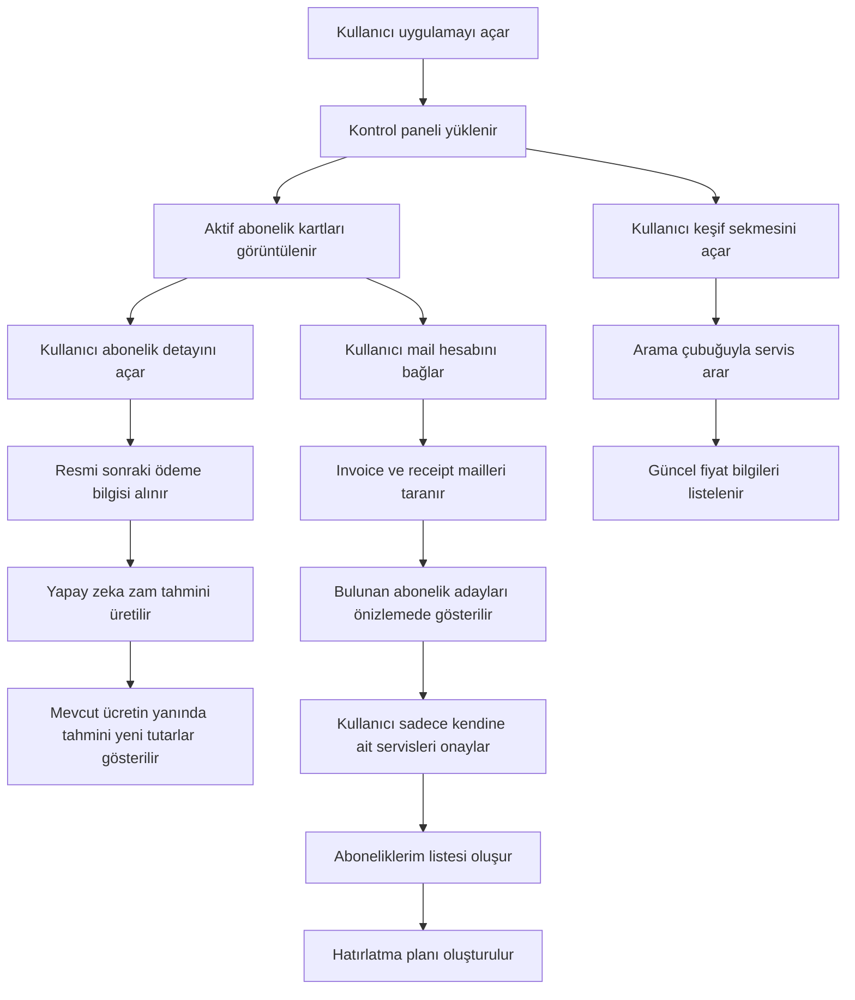

## 1. Ürün Özeti
Gider Takip, kullanıcıların aktif aboneliklerini tek ekranda hızlıca görmesini, yaklaşan ödemeleri takip etmesini ve yapay zeka destekli fiyat artışı öngörüleriyle önceden plan yapmasını sağlayan bir abonelik takip uygulamasıdır.
- Hedef kullanıcı kitlesi, birden fazla dijital servis, üyelik ve düzenli ödeme yöneten bireysel kullanıcılar ile sade bir finans görünümü isteyen yoğun kullanıcı profilleridir.
- Ürün değeri, dağınık abonelik bilgisini tek yerde toplayıp gelecekteki ödeme yükünü tahmini olarak görünür kılarak finansal farkındalığı artırmaktır.

## 2. Temel Özellikler

### 2.1 Kullanıcı Rolleri
| Rol | Kayıt Yöntemi | Temel Yetkiler |
|------|----------------|----------------|
| Standart Kullanıcı | E-posta veya sosyal giriş | Abonelik ekleme, düzenleme, listeleme, bildirim ayarlama, yapay zeka tahminlerini görüntüleme |

### 2.2 Özellik Modülleri
1. **Kontrol Paneli**: aktif abonelik özeti, toplam aylık gider, yaklaşan ödeme kartları, yapay zeka tahmin alanı ve iki ana sekme
2. **Abonelik Detay Sayfası**: servis görseli, mevcut ücret, sonraki ödeme tarihi, ödeme periyodu, fiyat geçmişi, zam tahmini, algılama kaynağı
3. **Mail Bağlama ve Analiz Akışı**: Gmail veya Outlook hesabı bağlantısı sonrası abonelik maillerini tarayıp yalnızca kullanıcı onayı verilenleri içeri alma
4. **Keşif Akışı**: abone olunabilecek servisleri güncel fiyatlarıyla arama çubuğu üzerinden listeleme

### 2.3 Sayfa Detayları
| Sayfa Adı | Modül Adı | Özellik açıklaması |
|-----------|-----------|--------------------|
| Kontrol Paneli | Aboneliklerim sekmesi | Yalnızca kullanıcının mail analizinden algılanıp onayladığı abonelikler gösterilir |
| Kontrol Paneli | Abone olunabilecek uygulamalar sekmesi | Kullanıcının abone olmadığı servisler güncel fiyatları, kategori bilgileri ve arama desteğiyle gösterilir |
| Kontrol Paneli | Hızlı filtreler | Aylık, yıllık, deneme süresi, yakında zamlanacak, yakında yenilenecek filtreleri bulunur |
| Kontrol Paneli | Yapay zeka tahmin paneli | Yalnızca kullanıcının abonelikleri için sonraki resmi fiyat ve tahmini artışlar gösterilir |
| Abonelik Detay Sayfası | Fiyat zaman çizelgesi | Geçmiş ödemeler, tespit edilen resmi fiyat güncellemeleri ve yapay zeka tahminleri zaman ekseninde gösterilir |
| Abonelik Detay Sayfası | Hatırlatma ve bildirim alanı | Kullanıcı ödeme günü, önceki gün veya özel tarih için bildirim tercihlerini yönetir |
| Mail Bağlama ve Analiz Akışı | Bağlantı formu | Kullanıcı mail sağlayıcısını ve hesabını seçer; gerçek ürün akışında OAuth ile bağlanır |
| Mail Bağlama ve Analiz Akışı | Analiz önizlemesi | Mail kutusundaki invoice, receipt ve payment confirmation maillerinden bulunan abonelik adayları listelenir |
| Mail Bağlama ve Analiz Akışı | Onay ve içeri alma | Kullanıcı yalnızca gerçekten kendisine ait olan servisleri seçerek Aboneliklerim alanına aktarır |
| Keşif Akışı | Arama çubuğu | Kullanıcı fiyatını görmek istediği servisi ada göre arar |
| Keşif Akışı | Fiyat kataloğu | Servisler güncel fiyat, kategori ve kaynak etiketi ile listelenir |

## 3. Temel Akış
Kullanıcı uygulamayı açtığında `Aboneliklerim` ve `Abone olunabilecek uygulamalar` sekmelerini görür. `Aboneliklerim` alanı boş başlar; kullanıcı Gmail veya Outlook hesabını bağladığında sistem gelen kutusunda fatura, receipt ve invoice maillerini tarar. Bulunan abonelik adayları önizlemede listelenir ve kullanıcı yalnızca gerçekten kendisine ait servisleri onaylayarak listeye ekler. `Abone olunabilecek uygulamalar` sekmesinde kullanıcının abone olmadığı servisler güncel fiyatları ve arama desteğiyle gösterilir. Yapay zeka katmanı yalnızca kullanıcının onayladığı abonelikler için sonraki ödeme ve zam tahmini üretir.

## 4. Kullanıcı Arayüzü Tasarımı
### 4.1 Tasarım Stili
- Ana renkler: koyu arduvaz zemin, yumuşak açık kart yüzeyi, vurgu için turkuaz ve sıcak yeşil
- Buton stili: geniş dokunma alanlı, yuvarlatılmış, hafif gölgeli ve net durum renklerine sahip
- Yazı karakteri ve boyutları: modern ama karakter sahibi başlık fontu, okunaklı gövde fontu, mobilde minimum 16px temel metin
- Yerleşim stili: kart tabanlı, üstte özet, altta akıllı filtreler ve görsel odaklı abonelik listesi
- İkon önerisi: servis logoları, sade çizgi ikonlar, ödeme durumu için net renkli rozetler

### 4.2 Sayfa Tasarım Özeti
| Sayfa Adı | Modül Adı | Arayüz öğeleri |
|-----------|-----------|----------------|
| Kontrol Paneli | Sekme anahtarı | Üst alanda `Aboneliklerim` ve `Abone olunabilecek uygulamalar` sekmeleri bulunur |
| Kontrol Paneli | Abonelik listesi | Sol tarafta uygulama görseli, ortada abonelik adı, sağda ücret ve ödeme tarihi, ayrıca mail analiz rozeti bulunur |
| Kontrol Paneli | Yapay zeka tahmin paneli | Mevcut ücretle hizalı tahmini zam alanı, oran rozeti, gelecek ay projeksiyon mini grafiği |
| Kontrol Paneli | Keşif listesi | Güncel fiyat, kaynak etiketi, arama çubuğu ve dış bağlantı düğmesi içerir |
| Abonelik Detay Sayfası | Fiyat geçmişi | Zaman çizelgesi, küçük çizgi grafik, resmi fiyat ve tahmin renk ayrımı |
| Mail Bağlama ve Analiz Akışı | Bağlantı kartı | Sağlayıcı seçimi, e-posta alanı, güvenli OAuth notu ve analiz düğmesi |
| Mail Bağlama ve Analiz Akışı | Önizleme alanı | Taranan maillerden bulunan abonelik adayları, fiyatları ve güven skoru listelenir |

### 4.3 Duyarlılık
Tasarım masaüstü öncelikli hazırlanır ancak bileşenler mobil uygulamaya taşınabilecek şekilde modüler ve dokunma öncelikli tasarlanır. Kart yapıları, durum rozetleri, filtre çipleri ve liste bileşenleri hem web hem gelecekteki mobil istemcide ortak tasarım sistemi mantığıyla kullanılabilir. Mobil görünümde alt gezinme, büyük dokunma alanları ve tek sütun akış tercih edilir.

## 5. Ürün Notları ve Kısıtlar
- Proje adı tüm ürün yüzeylerinde `Gider Takip` olarak kullanılacaktır.
- İlk sürümde ana veri toplama mantığı `e-posta taraması` olmalıdır; diğer yöntemler sonraki aşamalar için mimaride hazır tutulabilir.
- `Aboneliklerim` sekmesinde kullanıcının onaylamadığı veya mail analizinde bulunmayan hiçbir servis gösterilmemelidir.
- `Abone olunabilecek uygulamalar` sekmesinde yalnızca kullanıcının abone olmadığı servisler listelenmelidir.
- Kullanıcının sağladığı API anahtarı güvenlik nedeniyle istemci tarafına gömülmemeli, yalnızca sunucu tarafı ortam değişkeni olarak kullanılmalıdır.
- Yapay zeka tahminleri bilgilendirme amaçlı sunulmalı, kesin fiyat garantisi olarak gösterilmemelidir.
