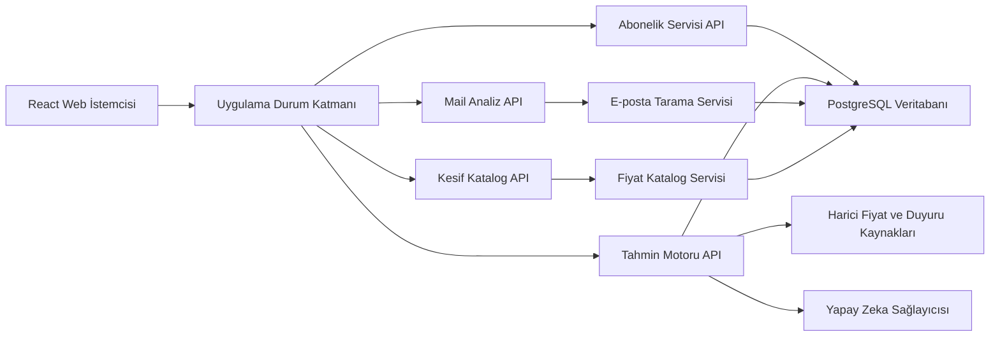
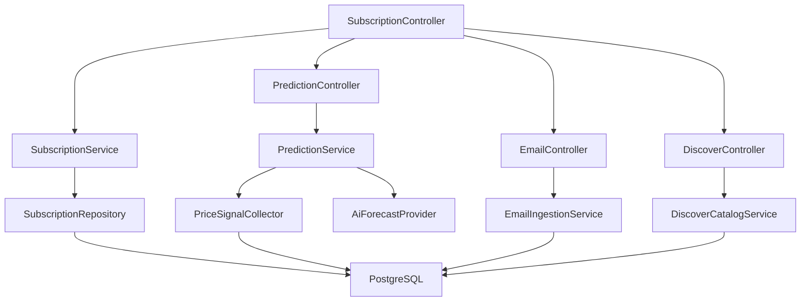
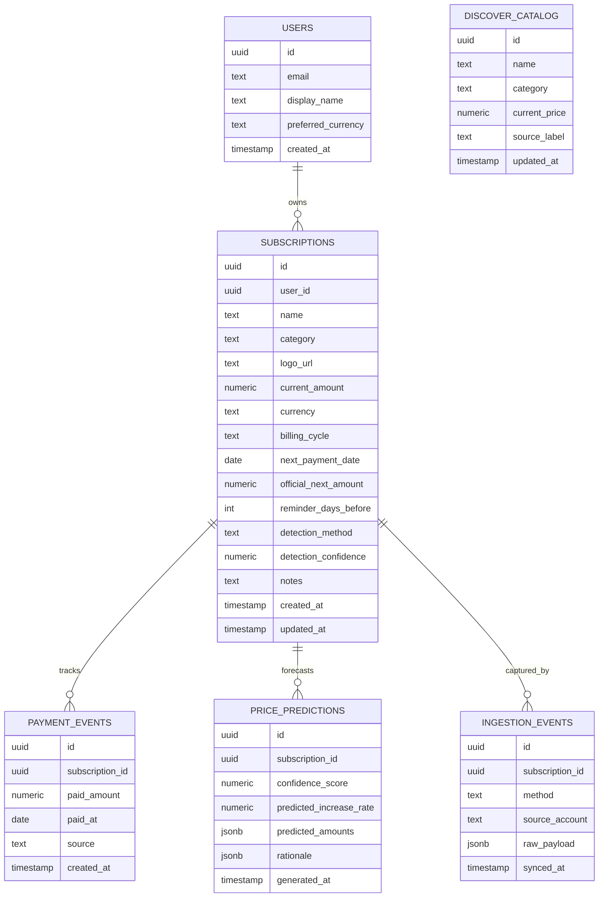

## 1. Mimari Tasarım


## 2. Teknoloji Tanımı
- Frontend: React 18 + TypeScript + Vite + Tailwind CSS 3
- Tasarım sistemi: Ortak token yapısı, yeniden kullanılabilir kartlar, filtre çipleri, form alanları ve durum rozetleri
- Durum yönetimi: TanStack Query + hafif istemci durumu için Zustand
- Backend: Node.js + Express 4 + TypeScript
- Veritabanı: PostgreSQL
- Kimlik doğrulama: E-posta tabanlı oturum açma veya gelecekte sosyal girişe açık JWT tabanlı yapı
- Yapay zeka katmanı: Sunucu tarafında çağrılan tahmin servisi, API anahtarı yalnızca ortam değişkeninde tutulur
- Veri toplama katmanı: Gmail veya Outlook tarama adaptörü, ilk sürümde OAuth tabanlı e-posta bağlantısı
- Keşif katmanı: güncel fiyat odaklı katalog servisi ve arama API'si
- Mobil uyumluluk stratejisi: API merkezli mimari, ortak veri sözleşmeleri ve tasarım token'ları sayesinde ileride React Native istemci eklenebilir

## 3. Rota Tanımları
| Rota | Amaç |
|------|------|
| / | Kontrol paneli ve aktif abonelik özetini gösterir |
| /abonelik/:id | Seçilen aboneliğin detayını, fiyat geçmişini ve tahminlerini gösterir |
| /abonelik/yeni | Mail hesabı bağlama ve analiz önizlemesini sunar |
| /ayarlar | Bildirim tercihleri, para birimi ve hesap ayarlarını yönetir |

## 4. API Tanımları
### 4.1 TypeScript Tipleri
```ts
export type BillingCycle = "weekly" | "monthly" | "quarterly" | "yearly";
export type DetectionMethod = "email" | "ocr" | "banking";

export interface Subscription {
  id: string;
  userId: string;
  name: string;
  category: string;
  logoUrl: string;
  currentAmount: number;
  currency: string;
  billingCycle: BillingCycle;
  nextPaymentDate: string;
  lastPaymentDate?: string;
  officialNextAmount?: number;
  reminderDaysBefore: number;
  notes?: string;
  detectionMethod: DetectionMethod;
  detectionConfidence: number;
  createdAt: string;
  updatedAt: string;
}

export interface IntakeMethod {
  id: DetectionMethod;
  title: string;
  description: string;
  source: string;
  trustLabel: string;
}

export interface IntakePreviewItem {
  name: string;
  currentAmount: number;
  currency: string;
  nextPaymentDate: string;
  billingCycle: BillingCycle;
}

export interface EmailConnection {
  provider: "gmail" | "outlook";
  email: string;
  connectedAt: string;
  lastScanAt: string;
}

export interface DiscoverSubscriptionItem {
  id: string;
  name: string;
  currentPrice: number;
  currency: string;
  sourceLabel: string;
  updatedAt: string;
}

export interface PricePrediction {
  subscriptionId: string;
  generatedAt: string;
  confidenceScore: number;
  predictedIncreaseRate: number;
  predictedAmounts: Array<{
    month: string;
    amount: number;
  }>;
  rationale: string[];
}
```

### 4.2 Uç Noktalar
| Yöntem | Uç Nokta | Amaç |
|--------|----------|------|
| GET | /api/subscriptions | Kullanıcının abonelik listesini ve özet metriklerini döner |
| POST | /api/subscriptions | Yeni abonelik oluşturur |
| GET | /api/subscriptions/:id | Tekil abonelik detayını döner |
| PATCH | /api/subscriptions/:id | Abonelik bilgilerini günceller |
| DELETE | /api/subscriptions/:id | Aboneliği arşivler veya siler |
| GET | /api/subscriptions/:id/prediction | Resmi sonraki ücret ve yapay zeka tahminlerini döner |
| POST | /api/subscriptions/:id/refresh | Harici veri taramasını ve tahmin güncellemesini tetikler |
| POST | /api/email/connect | Kullanıcının mail sağlayıcısını ve hesabını alıp analiz önizlemesi üretir |
| GET | /api/discover | Abone olunabilecek servisleri arama parametresiyle döner |
| GET | /api/intake/methods | Desteklenen takip yöntemlerini ve açıklamalarını döner |
| POST | /api/intake/simulate | Seçilen yönteme göre örnek tarama sonucu üretir |

### 4.3 Örnek Yanıt Şemaları
```ts
export interface SubscriptionListResponse {
  summary: {
    activeCount: number;
    monthlyTotal: number;
    upcomingAmount: number;
    upcomingDate?: string;
  };
  items: Subscription[];
}

export interface PredictionResponse {
  currentAmount: number;
  officialNextAmount?: number;
  prediction: PricePrediction;
}

export interface IntakeSimulationResponse {
  method: DetectionMethod;
  lastSyncAt: string;
  preview: IntakePreviewItem[];
}

export interface DiscoverResponse {
  query: string;
  items: DiscoverSubscriptionItem[];
}
```

## 5. Sunucu Mimari Diyagramı


## 6. Veri Modeli
### 6.1 Veri Modeli Tanımı


### 6.2 Veri Tanımlama Dili
```sql
CREATE TABLE users (
  id UUID PRIMARY KEY,
  email TEXT NOT NULL UNIQUE,
  display_name TEXT,
  preferred_currency TEXT NOT NULL DEFAULT 'TRY',
  created_at TIMESTAMP NOT NULL DEFAULT NOW()
);

CREATE TABLE subscriptions (
  id UUID PRIMARY KEY,
  user_id UUID NOT NULL REFERENCES users(id) ON DELETE CASCADE,
  name TEXT NOT NULL,
  category TEXT NOT NULL,
  logo_url TEXT NOT NULL,
  current_amount NUMERIC(10,2) NOT NULL,
  currency TEXT NOT NULL DEFAULT 'TRY',
  billing_cycle TEXT NOT NULL,
  next_payment_date DATE NOT NULL,
  official_next_amount NUMERIC(10,2),
  reminder_days_before INT NOT NULL DEFAULT 3,
  detection_method TEXT NOT NULL DEFAULT 'email',
  detection_confidence NUMERIC(4,2) NOT NULL DEFAULT 0.50,
  notes TEXT,
  created_at TIMESTAMP NOT NULL DEFAULT NOW(),
  updated_at TIMESTAMP NOT NULL DEFAULT NOW()
);

CREATE TABLE payment_events (
  id UUID PRIMARY KEY,
  subscription_id UUID NOT NULL REFERENCES subscriptions(id) ON DELETE CASCADE,
  paid_amount NUMERIC(10,2) NOT NULL,
  paid_at DATE NOT NULL,
  source TEXT NOT NULL DEFAULT 'manual',
  created_at TIMESTAMP NOT NULL DEFAULT NOW()
);

CREATE TABLE price_predictions (
  id UUID PRIMARY KEY,
  subscription_id UUID NOT NULL REFERENCES subscriptions(id) ON DELETE CASCADE,
  confidence_score NUMERIC(4,2) NOT NULL,
  predicted_increase_rate NUMERIC(6,3) NOT NULL,
  predicted_amounts JSONB NOT NULL,
  rationale JSONB NOT NULL,
  generated_at TIMESTAMP NOT NULL DEFAULT NOW()
);

CREATE TABLE ingestion_events (
  id UUID PRIMARY KEY,
  subscription_id UUID NOT NULL REFERENCES subscriptions(id) ON DELETE CASCADE,
  method TEXT NOT NULL,
  source_account TEXT NOT NULL,
  raw_payload JSONB NOT NULL,
  synced_at TIMESTAMP NOT NULL DEFAULT NOW()
);

CREATE TABLE discover_catalog (
  id UUID PRIMARY KEY,
  name TEXT NOT NULL,
  category TEXT NOT NULL,
  current_price NUMERIC(10,2) NOT NULL,
  source_label TEXT NOT NULL,
  updated_at TIMESTAMP NOT NULL DEFAULT NOW()
);

CREATE INDEX idx_subscriptions_user_id ON subscriptions(user_id);
CREATE INDEX idx_subscriptions_next_payment_date ON subscriptions(next_payment_date);
CREATE INDEX idx_price_predictions_subscription_id ON price_predictions(subscription_id);
CREATE INDEX idx_ingestion_events_subscription_id ON ingestion_events(subscription_id);
CREATE INDEX idx_discover_catalog_name ON discover_catalog(name);
```

## 7. Uygulama Notları
- Web istemcisi ile mobil istemci arasında ortak sözleşme için `/packages/contracts` benzeri paylaşımlı tip paketi önerilir.
- Logo ve uygulama görselleri başlangıçta CDN veya nesne depolama üzerinde tutulur; ileride mobil istemcide aynı URL yapısı kullanılabilir.
- Kullanıcının paylaştığı API anahtarı `AI_API_KEY` gibi bir sunucu ortam değişkeninde saklanmalı, frontend koduna yazılmamalıdır.
- İlk sürümde gerçek bağlantı yaklaşımı olarak `Google OAuth + Gmail API` ve `Microsoft OAuth + Graph API` tercih edilmelidir; düz şifre toplama önerilmez.
- Keşif kataloğu ilk aşamada küratörlü verilerle başlayabilir, sonra gerçek zamanlı fiyat toplama servisine dönüştürülebilir.
